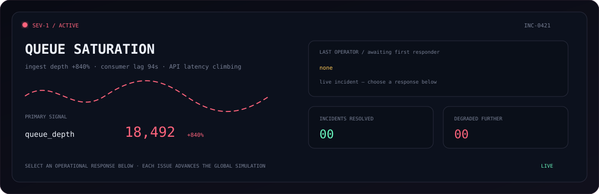

<div align="center">
  <picture>
    <source media="(prefers-color-scheme: light)" srcset="./assets/nour-os.svg">
    
  </picture>
</div>

<p align="center">
  <a href="#-production-incident-lab"><code>run incident lab</code></a>&nbsp;&nbsp;·&nbsp;&nbsp;
  <a href="https://github.com/nooribrahim06?tab=repositories"><code>inspect systems</code></a>&nbsp;&nbsp;·&nbsp;&nbsp;
  <a href="mailto:noorribrrahim2006s@gmail.com"><code>open channel</code></a>
</p>

<br>

## ◈ Production Incident Lab

This is not a screenshot. It is a small, stateful incident-response game running entirely on **GitHub Issues + Actions + Python + generated SVG**. Pick a response; the workflow evaluates the trade-off, updates the global incident, records the operator, and deploys the next scenario.

<div align="center">
  
</div>

<table width="100%">
<tr>
<td align="center" width="25%"><a href="https://github.com/nooribrahim06/nooribrahim06/issues/new?title=%5BINCIDENT%5D%20response%3A%20restart-service&body=Operator%20response%3A%20restart-service%0A%0AThis%20command%20will%20be%20evaluated%20by%20the%20incident%20engine."><code>↻ restart service</code></a></td>
<td align="center" width="25%"><a href="https://github.com/nooribrahim06/nooribrahim06/issues/new?title=%5BINCIDENT%5D%20response%3A%20scale-workers&body=Operator%20response%3A%20scale-workers%0A%0AThis%20command%20will%20be%20evaluated%20by%20the%20incident%20engine."><code>⇈ scale workers</code></a></td>
<td align="center" width="25%"><a href="https://github.com/nooribrahim06/nooribrahim06/issues/new?title=%5BINCIDENT%5D%20response%3A%20apply-backpressure&body=Operator%20response%3A%20apply-backpressure%0A%0AThis%20command%20will%20be%20evaluated%20by%20the%20incident%20engine."><code>◫ apply backpressure</code></a></td>
<td align="center" width="25%"><a href="https://github.com/nooribrahim06/nooribrahim06/issues/new?title=%5BINCIDENT%5D%20response%3A%20bypass-cache&body=Operator%20response%3A%20bypass-cache%0A%0AThis%20command%20will%20be%20evaluated%20by%20the%20incident%20engine."><code>⌁ bypass cache</code></a></td>
</tr>
</table>

<br>

## `nour@cairo:~/engineering$ cat direction.md`

I’m a Computer Engineering student at Cairo University working toward backend and ML infrastructure engineering. I want to understand the machinery beneath abstractions: schedulers, sockets, query planners, consistency models, queues, caches, and the failure modes that appear only after a system meets reality.

```text
CURRENT VECTOR
├── foundations     operating systems · networking · databases · algorithms
├── backend         APIs · clean architecture · performance · system design
├── distributed     replication · consistency · messaging · observability
└── intelligence    data pipelines · classical ML · production inference
```

<table width="100%">
<tr>
<td width="50%" valign="top">

### Systems I’m learning to build

- Services with explicit contracts and failure semantics
- Data paths with intentional consistency guarantees
- APIs that remain observable under pressure
- ML pipelines that are reproducible outside a notebook
- Infrastructure that is simple enough to operate

</td>
<td width="50%" valign="top">

### Instruments on the bench

```yaml
languages: [C++, Python, Java, JavaScript, SQL]
backend:   [Node.js, Express, FastAPI, Flask]
data:      [PostgreSQL, SQLite, MongoDB]
ml:        [NumPy, pandas, scikit-learn, Matplotlib]
systems:   [Linux, Git, GitHub Actions, Docker↗]
```

</td>
</tr>
</table>

<p align="center">
  <sub>Designed as a system, not assembled from profile widgets.</sub><br>
  <sub><code>Cairo · UTC+3</code>&nbsp;&nbsp;／&nbsp;&nbsp;<code>learning in public</code>&nbsp;&nbsp;／&nbsp;&nbsp;<code>building for the long game</code></sub>
</p>

