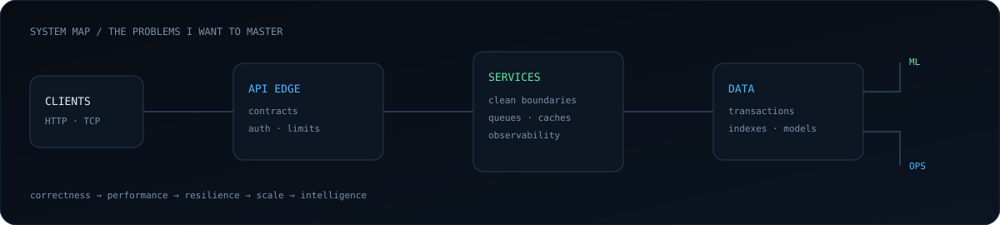
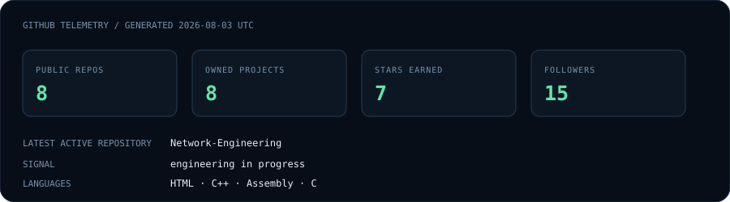

<div align="center">
  
</div>

<br/>

<table>
<tr>
<td width="58%" valign="top">

### `01 / engineering thesis`

I’m a **Computer Engineering student at Cairo University** learning to build the machinery behind reliable software: APIs, data systems, and distributed services that remain understandable when the happy path disappears.

I care less about collecting frameworks and more about the questions beneath them:

```text
How does the request cross the network?
Where does consistency break?
What happens under contention?
Can the system explain its own failure?
```

My trajectory is toward **backend engineering**, with a growing second track in **ML / AI engineering**—especially the infrastructure that makes intelligent systems dependable in production.

</td>
<td width="42%" valign="top">

### `02 / current operating state`

```yaml
location: Cairo, Egypt
education: Computer Engineering @ CU
mode: build → measure → understand

studying:
  - distributed systems
  - operating systems
  - databases
  - networking
  - system design

building_with:
  - Python / C++ / Java
  - Node.js / Express
  - FastAPI / Flask
  - PostgreSQL / MongoDB
```

</td>
</tr>
</table>

<div align="center">
  
</div>

### `03 / capability map`

<table>
<tr>
<td width="33%" valign="top">

#### Runtime & APIs

`Python` · `C++` · `Java`  
`JavaScript` · `SQL`  
`Node.js` · `Express`  
`FastAPI` · `Flask` · `REST`

Designing clear boundaries, predictable contracts, and boring-in-the-best-way failure handling.

</td>
<td width="33%" valign="top">

#### Data & Systems

`PostgreSQL` · `SQLite`  
`MongoDB` · `Linux`  
`Git` · `Docker` ↗

Studying indexing, transactions, concurrency, networking, caching, observability, and distributed trade-offs.

</td>
<td width="34%" valign="top">

#### Intelligence

`NumPy` · `pandas`  
`Matplotlib` · `scikit-learn`

Building the mathematical and engineering foundation for ML systems—not only notebooks, but reproducible data and inference pipelines.

</td>
</tr>
</table>

### `04 / system pulse`

<!-- This file is regenerated by .github/workflows/pulse.yml. -->
<div align="center">
  
</div>

### `05 / what I optimize for`

```diff
+ mechanisms over magic                 + production thinking over tutorial clones
+ explicit trade-offs over dogma        + measurement over intuition
+ small, composable boundaries          + continuous, deliberate improvement
```

I’m interested in backend architecture, performance, scalability, cloud infrastructure, DevOps, distributed systems, and open source. The long game is to become the kind of engineer trusted with systems where correctness, latency, and operability genuinely matter.

<p align="center">
  <sub><code>status: learning in public</code> · <code>next milestone: ship something that survives real users</code></sub>
</p>

